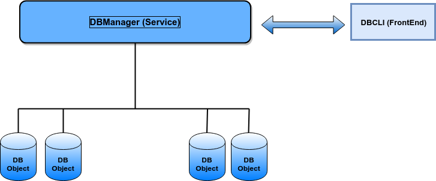

# REQUIREMENT
Simple Flat File DB implementation. Implementation provides no relation between storage objects; `8 byte`keys are only supported, or `uint64_t`. The application runs as a service.

## Setup
Run `make setup`. This creates the service file for the db, and placed under `/etc/systemd/`.

## Starting
After running `make setup`, the `dbcli` service must be start. Run `make start	` to fire the service.

## Usage

`dbcli <db filename> insert <id>`

inserts the number `<id>` into the database in `<db filename>`

`dbcli <db filename> find <id>`

Search for `<id>` in the database in `<db filename>`. If found, return success exit code. If not
found return failure exit code and print a meaningful error message to stderr.

`dbcli <db filename> delete <id>`

Remove the id number `<id>` from the database `<db filename>`. If a number is removed, a
subsequent ‘find’ should fail

## Requirements
Linux hosts only. For running the `test_db.c`file, `ThrowTheSwitch Unity Framework` is needed. See `https://github.com/ThrowTheSwitch/Unity`.

